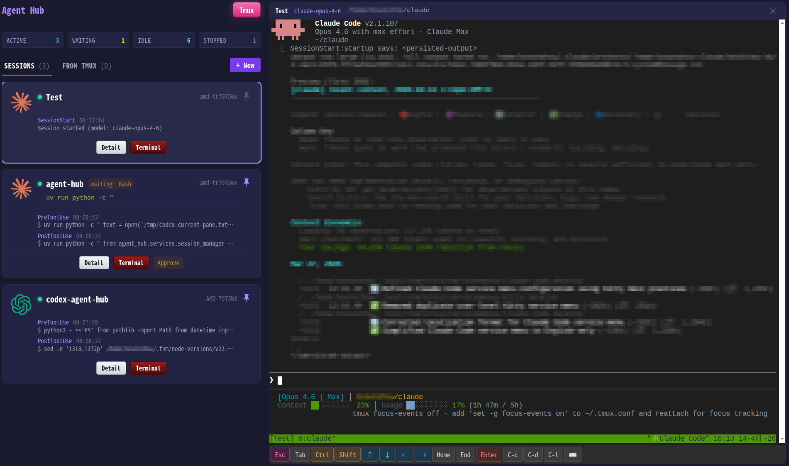
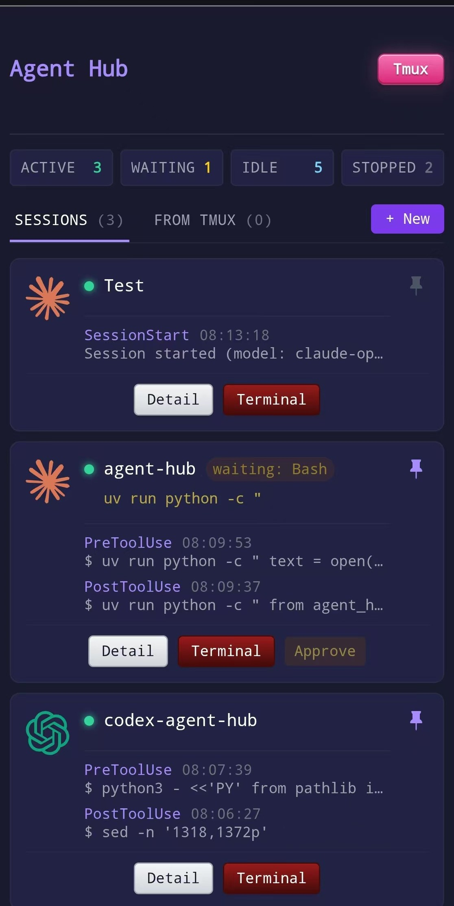

# Agent Hub

[](LICENSE)

Agent Hub 是一个面向 **Claude Code** 与 **Codex CLI** 的会话管理服务，用于集中查看会话状态、事件时间线、审批状态与 tmux 终端入口。

## 界面预览

<p align="center">
  
</p>
<p align="center"><em>桌面端 Dashboard：左列会话卡片 + 右列嵌入式终端</em></p>

<p align="center">
  
</p>
<p align="center"><em>移动端：单列布局，方便在手机上查看并审批</em></p>

## 核心能力

- 统一管理 Claude Code 与 Codex CLI 会话
- 记录会话事件并在 Dashboard 中实时展示
- 基于 tmux 进行远程审批与终端接入
- 通过 MCP SSE 暴露查询接口
- 支持 Telegram 待审批通知

## 快速开始

```bash
uv sync
./start.sh
# 或
uv run agent-hub serve --hub-id <hub-id>
```

默认情况下：

- Dashboard: `http://localhost:7800`
- API docs: `http://localhost:7800/api/docs`
- MCP SSE: `http://localhost:7800/mcp/sse`

## 远程访问（Tailscale）

Hub 监听 `0.0.0.0`，但无需把端口暴露到公网。推荐用 [Tailscale](https://tailscale.com/) 组建私有网络，在任意设备上通过 Hub 主机的 Tailscale IP 直接访问：

- 手机上打开 `http://<TAILSCALE_IP>:7800` 即可随时查看会话、远程审批
- 嵌入式终端（端口 7700）同样经 Tailscale 访问，可直接在手机上接入 tmux
- 跨机器访问：辅助机设置 `export AGENT_HUB_URL="http://<TAILSCALE_IP>:7800"` 后即可把事件推送到 Hub
- 全程走 Tailscale 加密隧道，不开放任何公网端口，比端口转发更安全

> 如果你有自己的云服务器，也可以用 [Nebula](https://github.com/slackhq/nebula) 自建 lighthouse 作为替代。中转节点掌握在自己手里，延迟更可控、通常更快。Hub 监听 `0.0.0.0`，对 Tailscale / Nebula 等任意私有网段都是开箱即用的。

详细配置见 `SETUP.md`。

## Web Terminal（嵌入式终端）

Dashboard 右侧的嵌入式终端由独立的伴生服务 **[web-terminal](https://github.com/BoZhen/webterminal)** 提供（默认端口 7700），负责把 tmux 会话以持久化终端的形式渲染到浏览器中。Hub 通过 iframe 嵌入它，用于终端预览与远程审批。

该服务需单独部署，安装方式见其仓库说明与本仓库 `SETUP.md` 的「Web Terminal」一节。

### Claude Code

Claude 通过本地 hooks 将事件推送到 Hub。推荐按 `SETUP.md` 或本文仓库中的配置示例完成接入。

### Codex CLI

支持两种方式：

1. **推荐：OMX hook 模式**  
   通过 `scripts/codex-hub-hook.sh` 将 Codex 事件桥接到 Hub。

2. **回退：tmux 扫描模式**  
   未接入 OMX 时，Hub 仍可通过 tmux pane 扫描发现 Codex 会话并提供基础管理能力。

### OMX HUD 说明

如果你觉得 OMX 在 tmux 底部创建的 HUD 状态栏过高或没有必要，可以禁用它：

```bash
export OMX_DISABLE_HUD=1
```

建议将该环境变量写入你的 shell 配置后，重新启动 omx session。已有的旧 tmux / omx 会话如果没有继承这个环境变量，仍可能继续显示 HUD。

## 常用页面

- `/`：主 Dashboard
- `/idle`：空闲会话
- `/stopped`：已停止会话
- `/tmux`：tmux 管理页
- `/sessions/{id}`：单会话详情页

## 常用接口

- `POST /api/events`
- `GET /api/sessions`
- `GET /api/sessions/{id}`
- `POST /api/sessions/{id}/approve`
- `GET /api/stats`
- `WS /ws`
- `GET /mcp/sse`

## 文档导航

- `DESIGN.md`：系统框架、运行拓扑、接口分层与核心设计
- `SETUP.md`：安装、启动与 hook 配置
- `ROADMAP.md`：开发路线记录

## 开发说明

项目主代码位于 `src/agent_hub/`，测试位于 `tests/`。

如需理解系统架构、模块分层、tmux 设计、状态机与接口关系，请直接阅读 `DESIGN.md`。

## License

[MIT](LICENSE)
